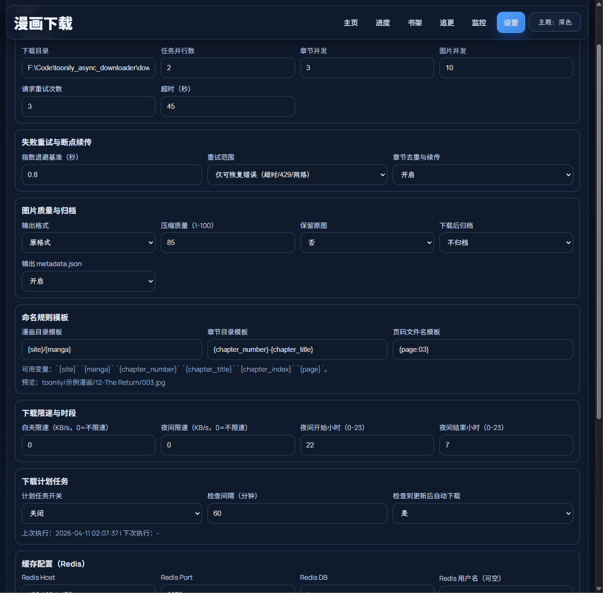
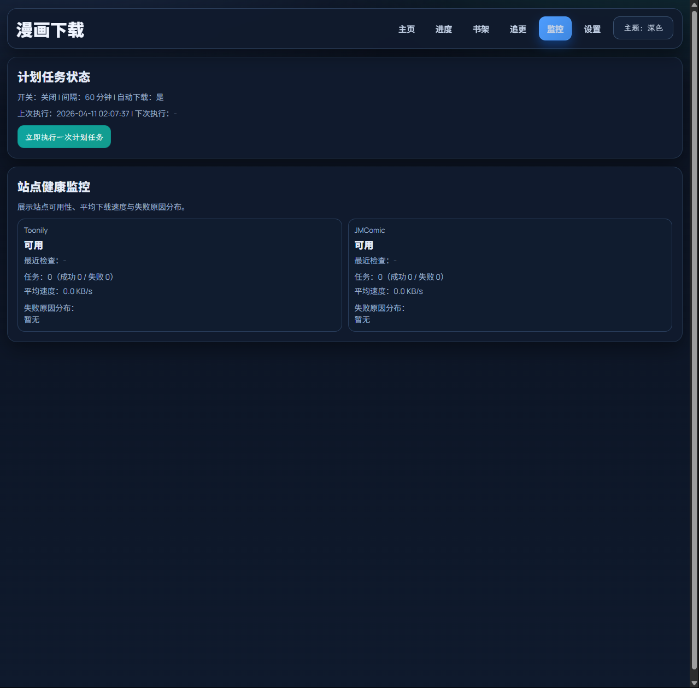
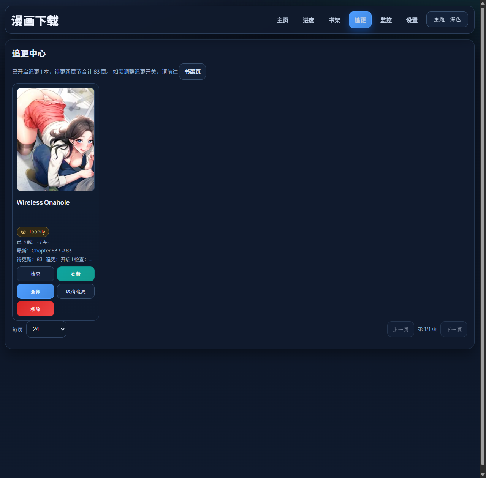
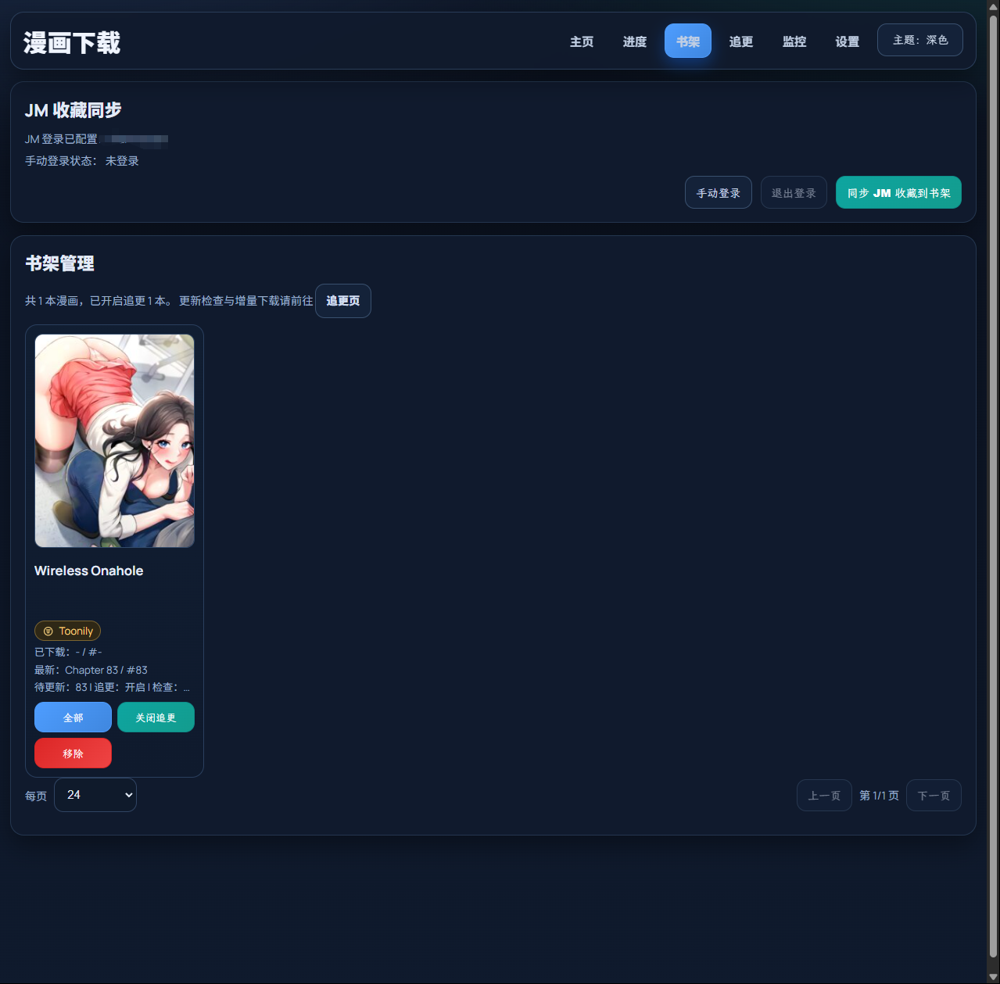
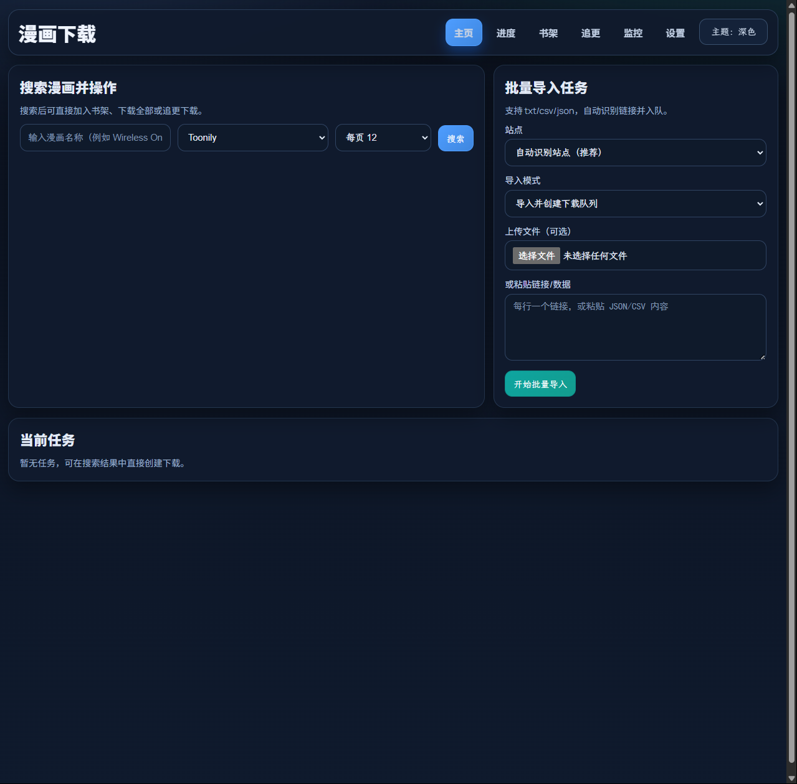

# comic-downloader

一个基于 `aiohttp` 的异步漫画下载 WebUI，支持搜索、书架管理、追更下载、任务调度和健康监控。

## 界面预览







## 功能概览

- 异步下载（章节/图片并发）
- 站点插件化（当前内置 `Toonily`、`JM`）
- 书架管理（新增、移除、追更开关）
- 追更中心（检查更新、下载增量）
- 任务控制（暂停、继续、取消、实时日志）
- 批量导入链接（文本 / csv / json）
- 定时调度（周期扫描并自动入队）
- 下载输出控制（目录模板、格式转换、归档、metadata）
- WebUI 主题切换（浅色/深色）

## 运行方式

### 1) 本地 Python

要求：Python 3.10+

```bash
pip install -r requirements.txt
python main.py --port 8000
```

访问：`http://127.0.0.1:8000`

### 2) Docker Compose

默认镜像标签已设置为 `latest`：

```bash
docker compose up -d
```

## 常用参数

```bash
python main.py --host 127.0.0.1 --port 8000 --skip-auto-install
```

- `--skip-auto-install`：跳过启动前依赖自动安装
- `--port`：固定端口（端口占用会直接退出并提示）

## 目录结构

```text
app/              Web 路由与页面渲染
core/             Provider 抽象与加载器
downloaders/      下载器实现（toonily / jm）
providers/        Provider 插件
templates/        Jinja2 页面模板
data/             运行时数据（settings/bookshelf）
downloads/        下载输出目录
img/              README 相关图片
```

## 日志说明

启动后会输出访问日志与任务日志：

- 访问日志：请求路径、状态码等
- 任务日志：`[job:xxxx] [HH:MM:SS] ...`

## 镜像拉取

镜像地址：`ghcr.io/cloudcranesss/comic-downloader:latest`

如果需要固定版本，也可使用：`ghcr.io/cloudcranesss/comic-downloader:v<version>`
